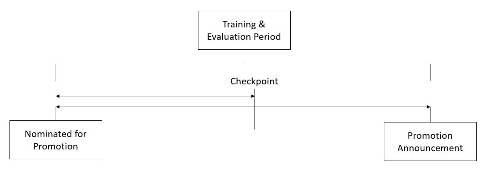

# Analytics-Vidhya---HR-Analytics

<h2> Problem Statement: </h2>
Your client is a large MNC and they have 9 broad verticals across the organisation. One of the problem your client is facing is around identifying the right people for promotion (only for manager position and below) and prepare them in time. Currently the process, they are following is:

They first identify a set of employees based on recommendations/ past performance
Selected employees go through the separate training and evaluation program for each vertical. These programs are based on the required skill of each vertical
At the end of the program, based on various factors such as training performance, KPI completion (only employees with KPIs completed greater than 60% are considered) etc., employee gets promotion
For above mentioned process, the final promotions are only announced after the evaluation and this leads to delay in transition to their new roles. Hence, company needs your help in identifying the eligible candidates at a particular checkpoint so that they can expedite the entire promotion cycle. 

Evaluation Metric - <i> F1 Score </i>

<h2> Things I tried : </h2> 
<ol> <li> <h3> Feature Engineering </li>
  <ul> 
    <li> Binned Age </li>
    <li> Sum of awards_won, previous_rating & if kpi >80% </li>
    <li> avg_rating * number of ratings </li>
    <li> work_fraction('length_of_service'/ 'age'),start_year('age'-'length_of_service') </li>
    <li> If he/she has better average rating then average rating in his/her department in his/her region </li>
    <li> Automatic feature engineering by multiplying and dividing continuous columns </li>
  </ul>
  <li> <h3> Models Tried </h3> </li>
  <ul>
    <li> Model - 1 :- Old Features (Random Forest Classifier)</li>
    <li> Model - 2 :- New Features set (Random Forest Classifier) </li>
    <li> Model - 3 :- New Features set (continous columns divided * multiplied) (Random Forest Classifier) </li>
    <li> Model - 4 :- Feature Selection followed by Random Forest Classifier </li>
  </ul>
  <li> <h3> Ensembling Approches </h3> </li>
  <ul>
    <li> Added probabilities after standardising the weights in accordance with F1-score (sum and exponential smoothing)  </li>
    <li> Majority voting from all four models </li>
    <li> Ensemble of best weighted predictions </li>
    <li> Threshold analysis for classification due to low event rate </li> 
  </ul> 
  </ol>

<h2> Results and Observations : </h2> 
<ul> 
  <li> Baseline Logistic Model has f1-score of 0.15 for event_rate = 08.517% </li>
  <li> Able to achieve 0.49 from just Bagging methods and some feature engineering </li>
  From the following graphs you can see feature engineering worked, all high importance features (Information values & Random Forest Feature Importance ) are derived features.
  
  
  
  
  
  Following graph saw the performance improvement over approaches:- 
  
  
  
<h2> Things to try in future : </h2>
<ul> 
  <li> Boosting Methods </li>
  <li> Oversampling & Undersampling Methods </li>
  <li> AutoML pipeline (TPOT is a Python Automated Machine Learning tool that optimizes machine learning pipelines using genetic programming)</li>
  <li> Polynomial and Domain specific Feature Engineering </li> 
  <li> Commonality identification of target population </li>
  <li> Labels remediation by understanding wrongly classified predictions </li>
  </ul>
  
  
